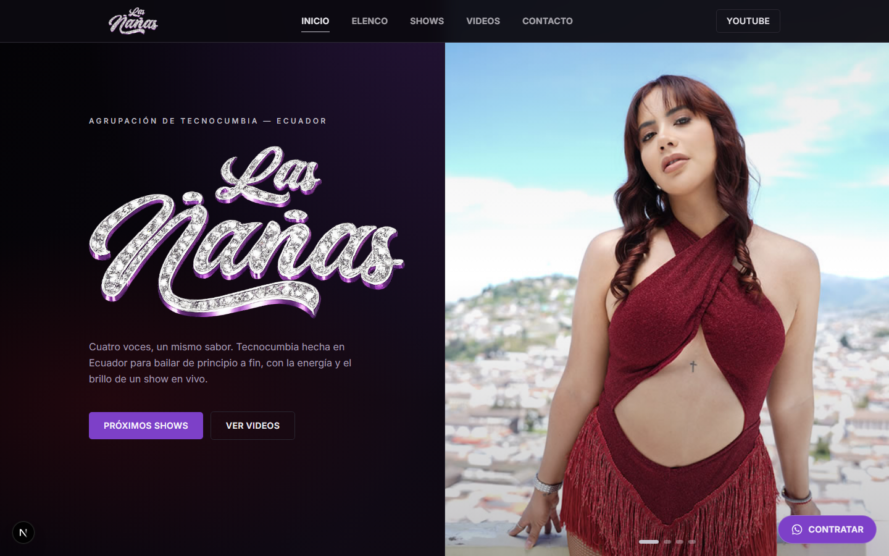
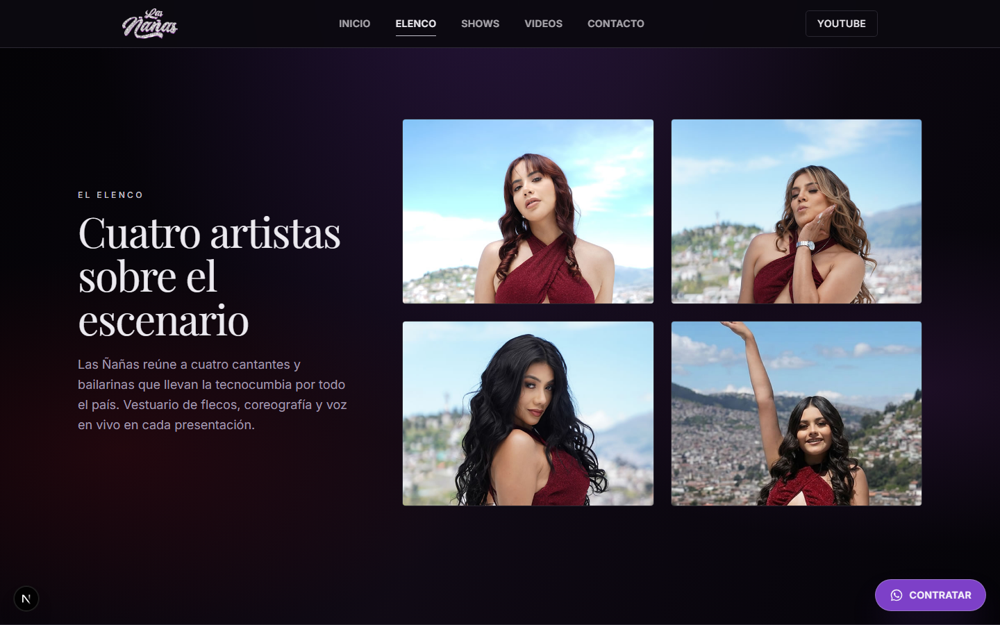
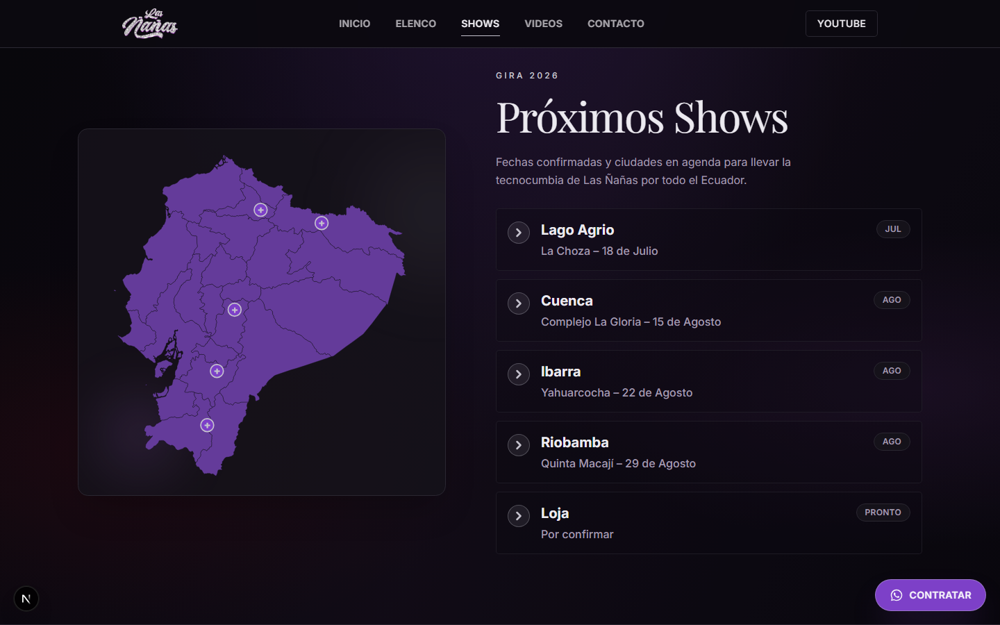
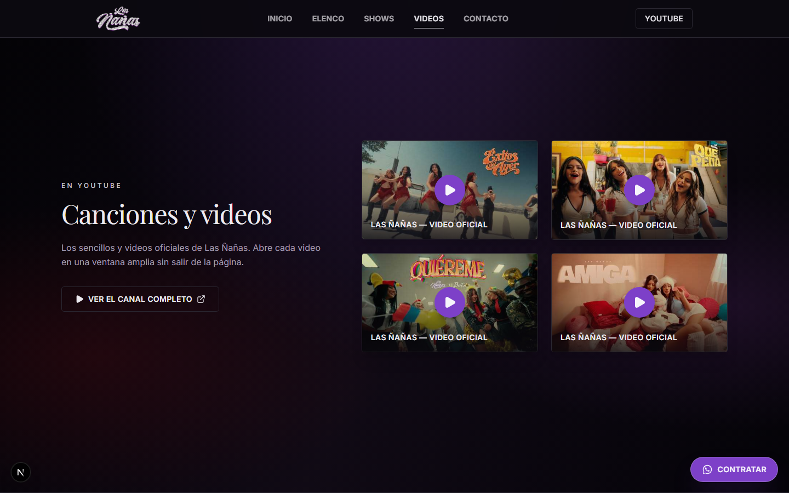
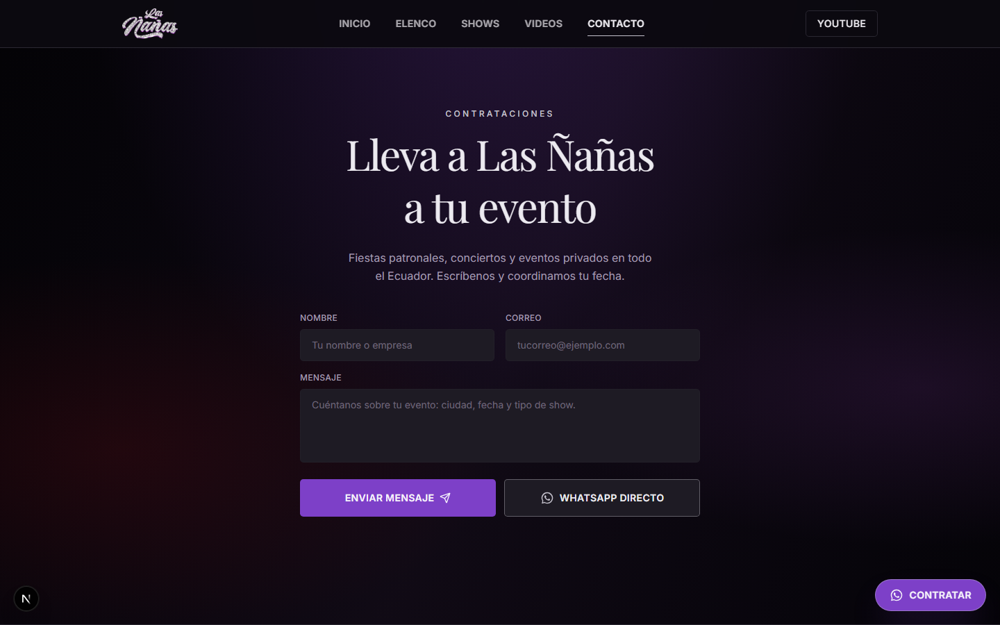
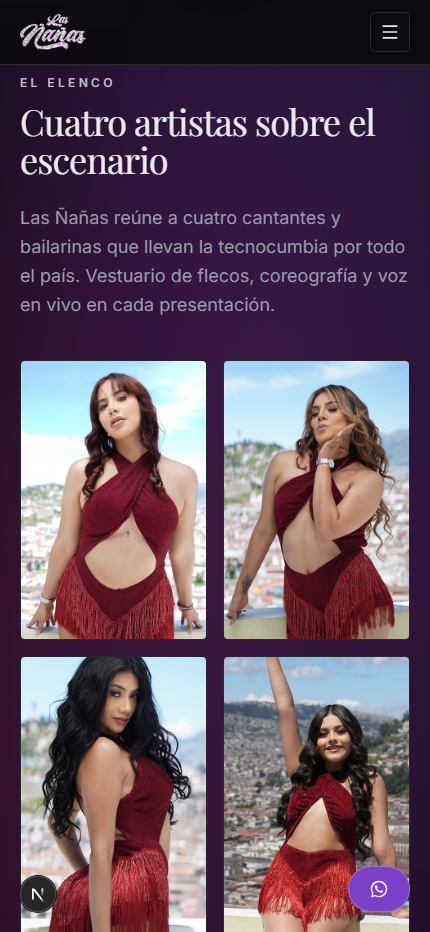

# Las Nanas - Propuesta Web

Landing page moderna para el grupo musical **Las Nanas**, creada como una propuesta visual y comercial para mejorar su presencia digital.

La pagina actual del grupo es funcional, pero se siente muy simple y no transmite con fuerza la energia, identidad y nivel artistico que Las Nanas muestran en sus presentaciones. Esta propuesta busca darle una presencia mas profesional, llamativa y clara: con una portada visual, secciones para el elenco, shows, videos, contacto directo y una experiencia responsive para celular y escritorio.

> Las imagenes usadas en esta propuesta fueron tomadas de la pagina web actual de Las Nanas y se usaron como referencia visual para presentar una version renovada del sitio.

## Vista Previa

### Escritorio

### Movil

### Recorrido en video

[Ver recorrido de escritorio](capturas-venta/09-recorrido-escritorio.webm)

## Que Incluye

Esta propuesta incluye unicamente el **source code** del sitio web. Es decir, se entrega el codigo fuente necesario para que un desarrollador pueda revisar, modificar o desplegar la pagina.

No incluye configuracion de hosting, dominio, despliegue en produccion, mantenimiento, correos, integraciones externas ni cambios posteriores. Si el cliente desea avanzar con configuracion, publicacion o ajustes adicionales, esos servicios tendrian un costo extra.

## Tecnologias

- Next.js
- React
- TypeScript
- Tailwind CSS
- Framer Motion

## Autor

Desarrollado por **Jairo Teran**.
